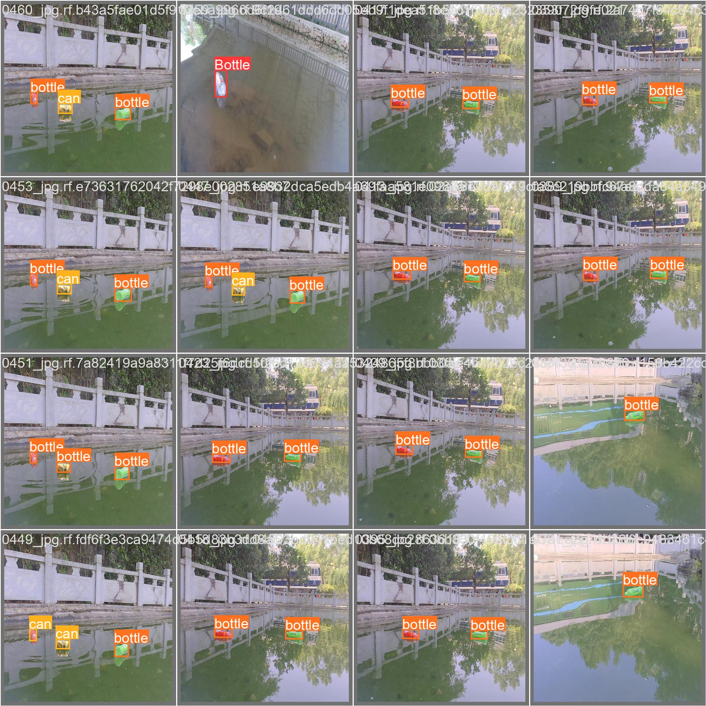
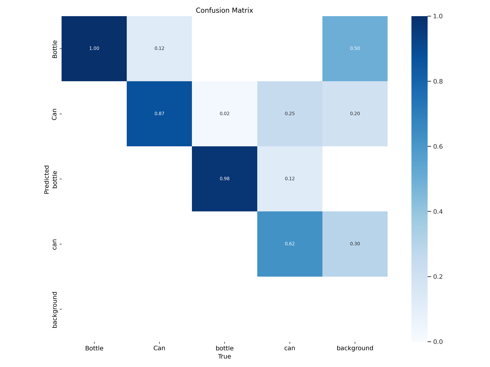

# TrashBot

This repository contains the files for object detection and tracking of botttles and cans. The purpose is for the algorithm of the TRITON garbage collection robot.

The metrics of the model are shown below.
