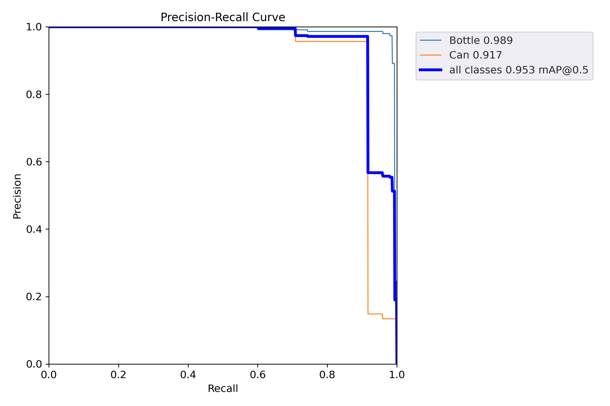

# TRITON

This repository contains the files for object detection and tracking of botttles and cans. The purpose is for the algorithm of the TRITON garbage collection robot.


The metrics of the model are shown below.


## Installation
```
git clone --recurse-submodules https://github.com/abayoral/TRITON
```

## Usage
```
python yolov5/train.py --img 640 --epochs 10 --data datasets/data.yaml --weights yolov5s.pt
```

